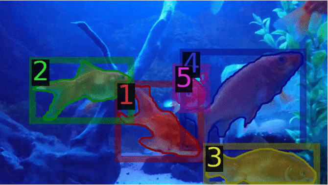

# TLTM: Two-Level Temporal Relation Model for Online Video Instance Segmentation

Please [visit this link](https://arxiv.org/abs/2210.16795) for the paper.

[Cagan Selim Coban](https://cscoban.com),
[Oguzhan Keskin](https://www.linkedin.com/in/oguzhan-keskin/),
[Jordi Pont-Tuset](https://jponttuset.cat),
[Fatma Guney](https://mysite.ku.edu.tr/fguney/)





# Abstract

In Video Instance Segmentation (VIS), current approaches either focus on the quality of the results, by taking the whole video as input and processing it offline; or on speed, by handling it frame by frame at the cost of competitive performance. In this work, we propose an online method that is on par with the performance of the offline counterparts. We introduce a message-passing graph neural network that encodes objects and relates them through time. We additionally propose a novel module to fuse features from the feature pyramid network with residual connections. Our model, trained end-to-end, achieves state-of-the-art performance on the YouTube-VIS dataset within the online methods. Further experiments on DAVIS demonstrate the generalization capability of our model to the video object segmentation task.

# How to run?

This repository is based on Meta AI's famous detectron2 repository. This repository supports different video instance/object segmentation datasets such as DAVIS, Youtube-VIS and KITTI-MOTS. To get the required files, visit [this](https://drive.google.com/drive/folders/1csyLFIGpSKawtNIVMLSMmqvxc_lxJeta?usp=share_link) link. You need to put **jsons** folder under **datasets** folder, **trained_models** and **base_models** to **checkpoints** folder.

## Training

To train a network, follow this pattern:
```
python train_net.py --config-file <config-file> --num-gpus 2
```

## Evaluation

Evaluate on Youtube-VIS challenge:
```
python train_net.py --config-file configs/R101_ytvis.yaml --eval-only
```

Evaluate on DAVIS 2019 Unsupervised:
```
python train_net.py --config-file configs/R101_davis.yaml --eval-only
```

Evaluate on KITTI-MOTS:

```
python train_net.py --config-file configs/R101_mots.yaml --eval-only
```

# Citation

If you find this contribution useful for your work, please consider citing it:

```
@article{coban2023tltm,
  title={Two-Level Temporal Relation Model for Online Video Instance Segmentation},
  author={Coban, Cagan Selim and Keskin, Oguzhan and Pont-Tuset, Jordi and Guney, Fatma},
  year={2022},
  eprint={2210.16795},
  archivePrefix={arXiv},
  primaryClass={cs.CV}
}
```
